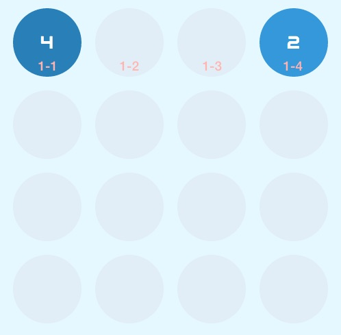
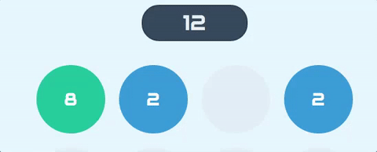
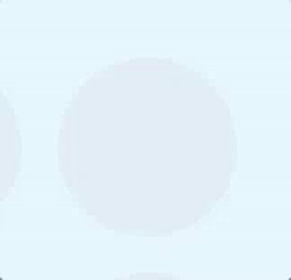

# 2048

## Description
2048 is a simple tiles game with straightforward controls and a flat learning curve. The difficulty, however, increases after each play, making it engaging and challenging.

The rules are simple: use your arrows to move the tiles around. Merge two tiles of the same value to form a new, higher tile. Keep doing that until you hit 2048. If your board fills up, it's game over.

Clicking on the **2048** logo starts a new game.

But careful: Pressing an arrow key moves all of the tiles at the same time, so you don't have control over individual tiles, but of the grid as a whole. So plan your next move in advance!

If you've never played it, I suggest you go have some fun with it:

[2048](https://clapinton.github.io/games/2048/)

### Credit
This project was based on [Gabriele Cirulli's](https://github.com/gabrielecirulli/2048) version, which was then based on an app called 1024.


## Features
Although the basic game doesn't have too many features, I decided to cook up some extra ones to spice things up a bit.

| Feature | Status | Comment |
|--------------------------------------------|:-----------:|:-------------------:|
| Basic gameplay | DEPLOYED | |
| Game Score | DEPLOYED | |
| Start New Game | DEPLOYED | |
| Difficulties | In Progress | |
| Save game state so player can return after leaving | | |
| Change color scheme | | |
| Easter Eggs | DEPLOYED 30 | | |


## Under the hood
The game was entirely built on vanilla JavaScript and jQuery for the logic, and HTML5/CSS3 coupled with SCSS for the styling. Animations happen through either simple CSS transitions (moving a tile) or the Web Animations API (score popup bubble).

The main algorithm flows as follows:
1. (DOM) Remove cells that were merged on the previous round;
2. (data) Search and Merge Tiles;
3. (data) Search and Move Tiles;
4. (DOM) Mirror the tiles data state to the DOM;
5. (data/DOM) Spawn a new tile at a random position;
6. (data/DOM) Update game score;
7. Loop until grid is full or one tile is 2048

There was a lot of thought put into the logic and the animation, so let's drill down into some of the most interesting bits:

### How data is stored
All tiles are stored in a POJO called `filledPositions`, with positions as keys and `Tile` objects as values for filled cells and false for empty ones:

```javascript
  filledPositions = {
    11: TileInstance,
    12: false,
    13: false,
    14: TileInstance
  }
```

Moving a tile around on the data side involves changing the corresponding value to the new key, and setting the old one to false:

```javascript
this.filledPositions[emptyPos] = this.filledPositions[oldPos];
this.filledPositions[oldPos] = false;
```

When a tile is merged into another, it is moved into another POJO called `mergedTiles`, which is cleaned at the beginning of each round. The structure is the same as the `filledPositions` object.

### General Search
Looping through the grid depends on the key that was pressed and the action we want to perform. Let's say I hit the &#8594; key and I now want to move the tiles to the correct place, which is as far RIGHT as possible. For a simple move (without merge) a piece can only go to the RIGHTmost empty cell. Therefore, we perform a linear search from right to left, searching for the first empty cell. In the case below, that's cell **1-3**:



Now that we have that, we search for the next non-empty cell, which is **1-1**. The next step is simply moving the tile from that cell into **1-3**.

In order to DRY the code, I wrote one single loop that goes through all 16 cells in one swoop, without having to next two loops (one for row and one for column). The loop goes from 0 to 15 and calculates the coordinates on each turn. Let's suppose we hit the &#8594; key again. That means we're performing a horizontal movement from left to right, so we do the search from right to left, as mentioned above. The loop then depends on 3 factors:
* what is the direction of the movement (Vertical or Horizontal)?
* which cell of the row should we star the loop in (1st or 4th)?
* what is the increment we should apply on each loop iteration (+1 if we're moving left-right and -1 is right-left)?

In our case, we have:
```javascript
case "RIGHT":
  params.increment = -1;
  params.startAt = 4;
  params.direction = "H";
```

#### Defining the row
The row would be the outermost loop, since it should increment by one each time we move through the 4 columns in it. Since our iteration (`cell` counter) goes from 0 to 15, we define the row as:
```javascript
row = Math.floor(cell/4) + 1;
```

#### Defining the column
The column is the inner most loop in this case and it depends on the start and increment factors. In our case, it is defined as:
```javascript
col = startAt + (increment * (cell%4));
```

Had we performed a Vertical movement, we would just reverse the definitions above. So our base search logic for moving becomes:
```javascript
let row, col, pos;
for (let cell = 0; cell < 16 ; cell++) {
  // The way we run through the cells depends on startAt and increment on the following way:
  // rowNum = startAt + (increment * (cell%4))

  if (direction === "V") {
    row = startAt + (increment * (cell%4));
    col = Math.floor(cell/4) + 1;
  } else {
    col = startAt + (increment * (cell%4));
    row = Math.floor(cell/4) + 1;
  };

  pos = this.posToString(row,col);

  // If there's NO tile on pos, look for the next tile to move it into the empty pos
  if (!this.filledPositions[pos]) this.searchAndMove(row, col, increment, direction);

```

### Merging
For merging, the logic is very similar: we start by looking for the first non-empty cell, which would be **1-4** above. Having that, we search for the next non-empty cell, which is again **1-1**. We then compare the values and, if they're the same, we merge them.

Actually merging is a two-step process:
* update one tile, doubling its value;
* move the other tile to the `mergedTiles` object, to be removed on the next round.


### Updating the DOM
After we're done with the merge and move logic, we have to update the DOM. Before we get to that, it's worth understanding how the tiles are positioned around.

#### Styling and Moving Tiles
All tiles on the DOM have three classes: `pos-13`, `val-4` and `tile`. The first one sets the actual position of the tile, while the second is used for coloring it correctly:
```css
.pos-13 {
  z-index: 1;
  transform: translate(250px, 20px); }

.val-4 {
  background-color: #2980b9; }
```

Notice the `z-index` property. When we merge two tiles, one ends up behind the other. Therefore, the one with the merged class gets assigned a lower `z-index`, to make sure it stays behind the doubled tile.

To move a tile, we simply assign another class, like `pos-14`. The third class, `tile` is responsible for the general styling and for defining `transition` for the `transform` property, which takes care of the animation for movement.


### Back to the DOM
Updating the DOM is done by iterating through the `filledPositions` object and, for every filled cell:
* remove the current `pos` class;
* interpolate the key (position) into a class name and assign that using jQuery:
```javascript
this.$html.removeClass(`pos-${this.position}`).addClass(`pos-${newPos}`);
this.position = newPos;
```

### DRYing up the CSS
As you can imagine, we need 16 classes for positions. We could type them all out, but maintaining them would be a pain. Imagine I wanted to increase the size of the cells and/or the whole grid. I'd then have to change each one manually. We're in 2016. There are smarter ways to do that. In this case, it's called SCSS.

`pos-11` starts at (10px, 20px). After that, we add the margins and width/height to calculate the adjacent tile. In our case, that increment is 120px, which results in the following code:
```scss
@for $row from 0 through 3 {
  @for $col from 0 through 3 {
    .pos-#{$row+1}#{$col+1} {
      z-index: 1;
      transform: translate(#{10+120*$col}px, #{20+120*$row}px);
    }
  }
}
```

### Animations
Achieving the basic movement animation is easily done through CSS' own `transition` property. But the following are not that straightforward:





These animations were achieved through the Web Animations API, allowing for a straightforward code:
```javascript
// Score bubble
bubble.animate({
  opacity: [0,1,0],
  transform: ["none", "translateY(-50px)"]
}, {
  // Iterations last for 500ms.
  duration: 500,

  // The timing function to use with each iteration.
  easing: 'linear'
});

// Tile spawning
tileEl.animate({
  transform: ['scale(0,0)', 'scale(1,1)'],
}, {
  // Apply effect during delay. Avoids flashing effect.
  fill: 'backwards',

  // Wait some time while move happens
  delay: 100,

  // Iterations last for 2000ms.
  duration: 200,

  // The timing function to use with each iteration.
  easing: 'linear'
});
```

## A note on CPU and GPU usage
